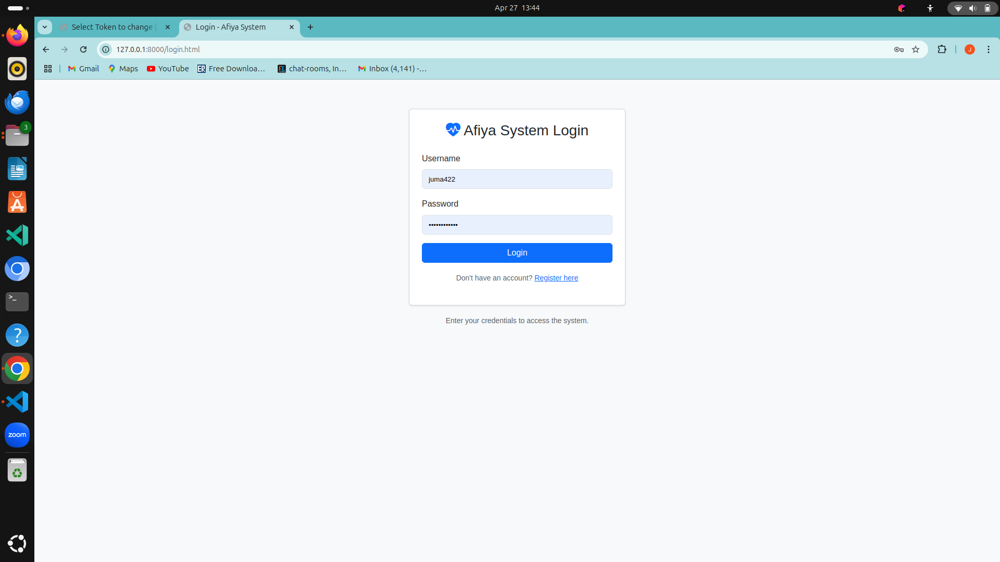
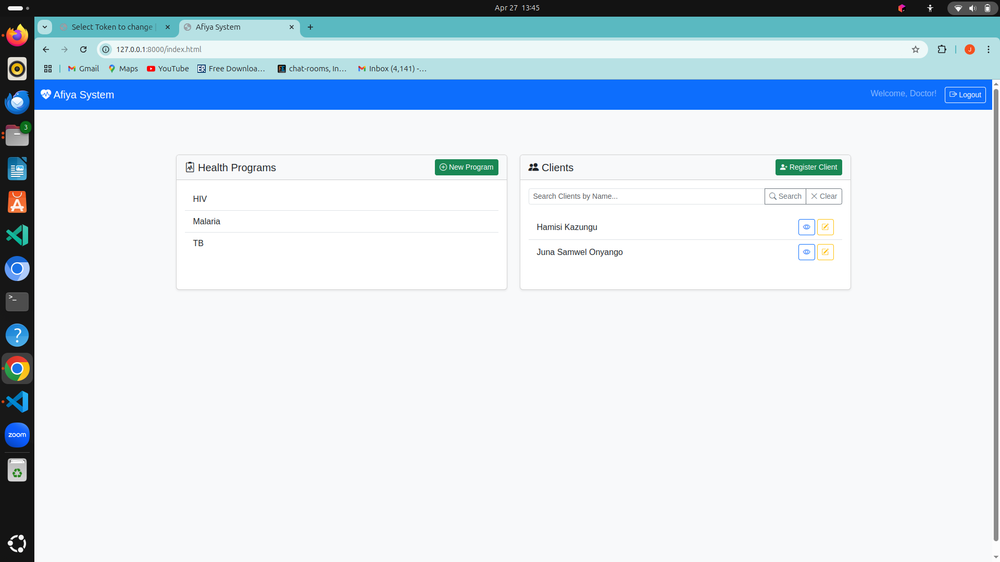
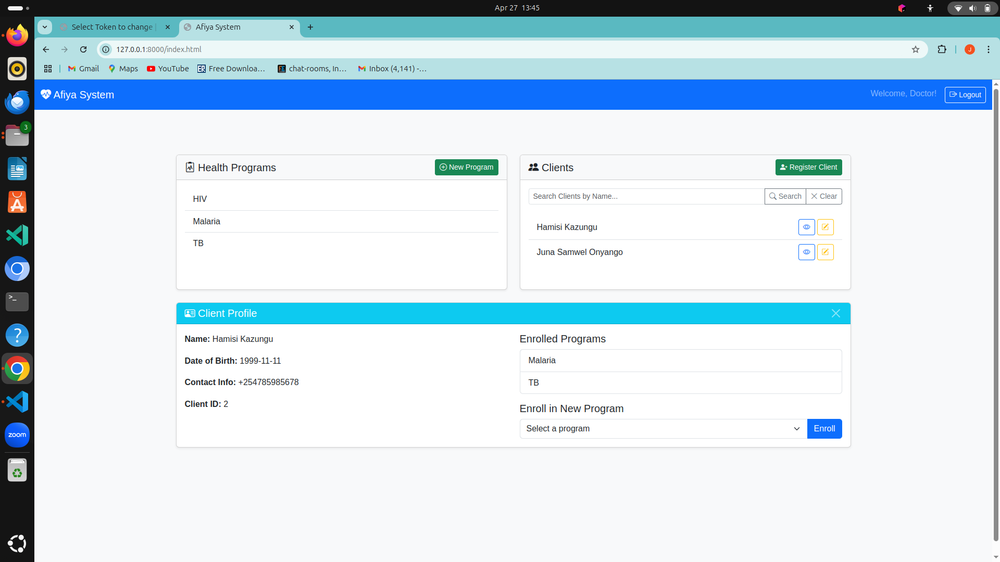
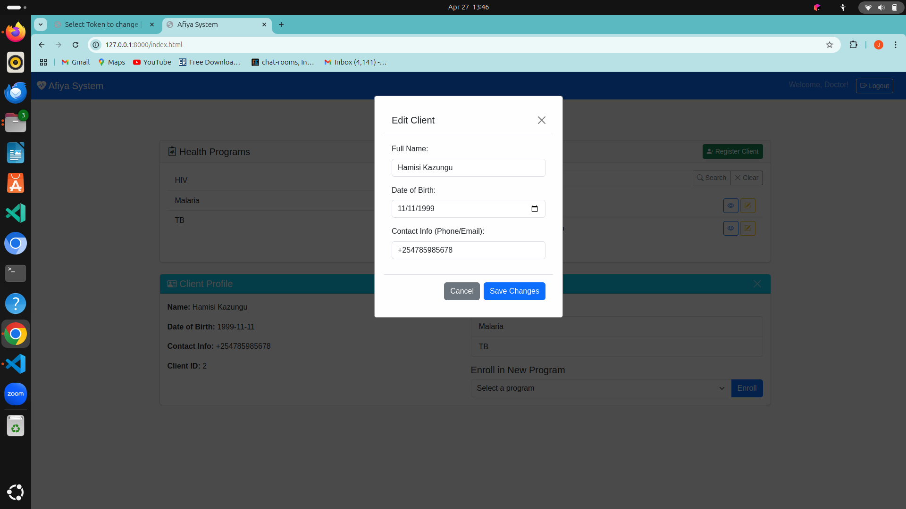
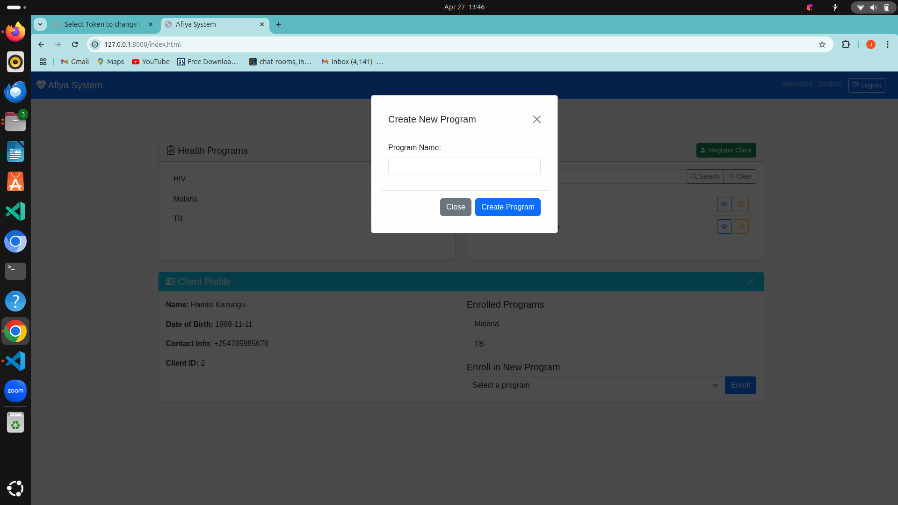
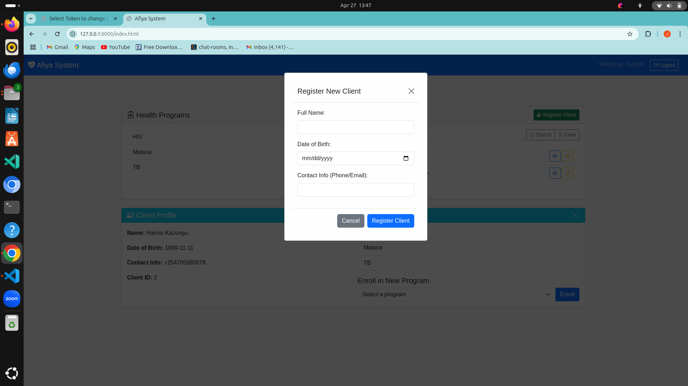

NOTE: POWERPOINT PRESENTATION LINK :  https://drive.google.com/file/d/1uyhryXBpatV1qiZAKh_gtqGcgCCJP5v_/view?usp=sharing

NOTE: PLEASE CLONE MASTER BRANCH TO RUN CODE ON YOUR MACHINE


# Afiya-System

A basic health information system simulation allowing doctors to manage clients and health programs (like TB, HIV). Features include client registration, program enrollment, search, and profile viewing via a simple web interface and API.

## Features

*   Doctor Registration & Login (Token-based API)
*   Client Registration & Management (Name, DOB, Contact)
*   Health Program Creation & Listing
*   Client Enrollment in Programs
*   Client Search Functionality
*   Client Profile Viewing (including enrolled programs)
*   REST API for Client and Program data

## Setup Instructions

Follow these steps to get the Afiya System running on your local machine.

**1. Prerequisites:**

*   **Python:** Ensure you have Python 3.8 or higher installed. You can download it from [python.org](https://www.python.org/).
*   **pip:** Python's package installer. It usually comes with Python. Make sure it's up to date (`python -m pip install --upgrade pip`).
*   **Git:** Required to clone the repository. Download from git-scm.com.
*   **(Optional) Virtual Environment Tool:** `venv` (built-in) or `virtualenv` (`pip install virtualenv`).

**2. Clone the Repository:**

Open your terminal or command prompt and clone the project:

```bash
git clone <your-repository-url> # Replace <your-repository-url> with the actual URL
cd Afiya-System # Or your project's root directory name

3. Create and Activate a Virtual Environment:

It's highly recommended to use a virtual environment to keep project dependencies isolated.

Using venv (Recommended):

bash
# Create the environment (e.g., named 'venv')
python -m venv venv

# Activate the environment:
# On Windows (cmd.exe):
venv\Scripts\activate.bat
# On Windows (PowerShell):
.\venv\Scripts\Activate.ps1
# On macOS/Linux (bash/zsh):
source venv/bin/activate
You should see (venv) prepended to your terminal prompt.

Using virtualenv (Alternative):

bash
# Create the environment
virtualenv venv

# Activate (same commands as above)
4. Install Dependencies:

Install all the required Python packages listed in the requirements.txt file:

bash
pip install -r requirements.txt
(Note: If a requirements.txt file doesn't exist yet, you might need to create one based on the project's imports or install Django and DRF manually: pip install django djangorestframework)

5. Apply Database Migrations:

Django uses migrations to set up and update the database schema. Run the following command:

bash
python manage.py migrate
This will create the necessary database tables (using the default db.sqlite3 file unless configured otherwise).

6. Create a Superuser (Admin):

To access the Django admin interface (optional but useful), create a superuser:

bash
python manage.py createsuperuser
Follow the prompts to set a username, email (optional), and password.

7. Run the Development Server:

Start the Django development server:

bash
python manage.py runserver
By default, the server will run at http://127.0.0.1:8000/.

8. Access the Application:

Web Interface: Open your web browser and navigate to:
http://127.0.0.1:8000/ (or the specific URL for the main frontend page, e.g., index.html if served statically)
http://127.0.0.1:8000/admin/ (to access the Django admin panel using your superuser credentials)
API Endpoints: You can access the API endpoints using tools like curl, Postman, or directly in the browser (for GET requests):
http://127.0.0.1:8000/afiya/login/ (POST for login)
http://127.0.0.1:8000/afiya/doctors/register/ (POST for registration)
http://127.0.0.1:8000/afiya/programs/ (GET, POST)
http://127.0.0.1:8000/afiya/clients/ (GET, POST)
http://127.0.0.1:8000/afiya/clients/<id>/ (GET, PUT, PATCH, DELETE)
http://127.0.0.1:8000/afiya/clients/<id>/enroll/ (POST)
http://127.0.0.1:8000/afiya/clients/search/?q=<query> (GET)
(Optional) 9. Run Tests:

If the project includes tests, you can run them using:

bash
python manage.py test
You should now have the Afiya System running locally!







